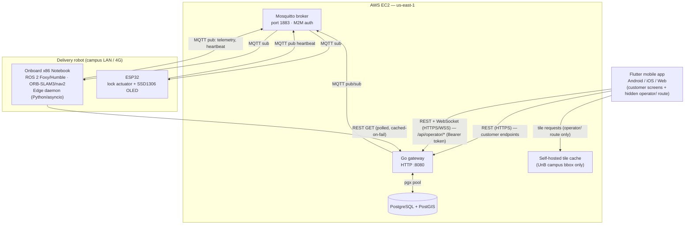

# MARMITRON 3000 — System Architecture

## Monorepo topology

```
unbot/
├── mobile/
│   └── lib/
│       ├── operator/    # Staff-only dashboard screens (NEW) — see "Known Technical Debt" below
│       └── ...           # Customer-facing screens, unchanged
├── gateway/         # Go HTTP + MQTT gateway (cloud VM)
├── hardware/
│   └── esp32-lock/  # C++ firmware (PlatformIO / Arduino)
└── docs/            # This folder
```

The onboard compute node (x86 notebook, see "Hardware topology" below) lives outside the monorepo on the robot itself; it communicates exclusively via MQTT and a read-only REST poll (see "Map authority" below). **The edge daemon never holds a database credential of any kind — this is an invariant, not a convention.**

---

## Known Technical Debt: Operator dashboard folded into `mobile/`

**Decision (recorded, not accidental):** for the 2-week milestone timeline, the operator dashboard ships as a hidden staff-only route inside the existing customer-facing `mobile/` app, rather than as a separate Flutter Web package. This trades architectural separation for development speed under a hard deadline.

**Conditions attached to this decision — non-negotiable, not optional cleanup:**

1. **The hidden route is not a security boundary.** Any route compiled into the app bundle is discoverable via decompilation or bundle inspection. The actual access control is, and must remain, the staff `Bearer` token check enforced server-side on every `/api/operator/*` endpoint (see PROTOCOL.md). Do not treat route obscurity as authentication.
2. **Code isolation is mandatory even without package isolation.** All operator code lives under `mobile/lib/operator/` as a self-contained subtree: its own routing, its own `OperatorApiService`, its own state management. It must never reference or mutate `activeOrdersNotifier`, `userStateNotifier`, or `pastOrdersNotifier` — the customer-facing global notifiers. This directory boundary is what makes future extraction to a standalone `operator/` package a `mv` operation, not a rewrite.
3. **Bundle size is now a customer-facing cost.** `flutter_map`, tile-rendering, and GeoJSON parsing dependencies ship inside the app every customer downloads. Acceptable for the milestone; revisit if customer app load time becomes a measured complaint.
4. **Entry point is a non-discoverable trigger, not a visible nav item.** Recommended: a long-press gesture on a low-traffic UI element, or a deep link route (e.g. `/ops-<random-suffix>`) — not a button in the customer bottom nav bar. This is UX hygiene, not security, per point 1.
5. **Follow-up plan**: extract `mobile/lib/operator/` into a standalone `operator/` Flutter Web package once the milestone deadline has passed, if the dashboard proves out. Because of point 2, this extraction is mechanical.

---

## Hardware topology — onboard compute pivot

The robot's high-level compute has moved from a Raspberry Pi 4 to an **x86 notebook** mounted inside the robot chassis. This runs the full ROS 2 desktop distribution (not `ros-base`) plus the same Python/asyncio edge daemon.

**What changed:**
- Compute headroom: full x86 desktop resources replace ARM/4GB constraints. No architectural concern remains around nav2 planner memory/CPU budgets.
- `edge_daemon`'s existing stub-mode detection (`rclpy` import check at runtime) requires no changes — it already treats "real ROS 2 present" as a runtime branch, and this branch now resolves identically on x86 dev laptops and the onboard notebook.

**What did NOT change:**
- The edge daemon still holds **zero database credentials** — this invariant is orthogonal to the hardware substitution.
- The onboard notebook is still behind CGNAT (4G LTE router or campus Wi-Fi) and still only **initiates outbound** connections — it does not become reachable from the cloud.
- All MQTT topics, REST contracts, and telemetry payload schemas are unchanged (see PROTOCOL.md).

**New operational consideration — power source ambiguity:**
The notebook has its own internal battery, separate from the robot's traction/chassis battery. `robot_telemetry.battery_percent` must be explicitly scoped to **one** of these — recommended: the robot's main traction battery, since that's the operationally relevant number for delivery range and E-stop decisions. If notebook battery state is also worth tracking (e.g., to detect an imminent compute shutdown independent of the robot's mobility), it should be a **separate telemetry field**, not conflated into the same `battery_percent` value. See STATE_FLOW.md schema notes.

---

## Runtime topology



### Node responsibilities

| Node | Runtime | Responsibility |
|---|---|---|
| **Flutter mobile app** | iOS / Android / Web | Customer: order placement, OTP display, QR scanner, order tracking. Staff (hidden route): live delivery map, telemetry replay, campus zone CRUD, E-stop/resume actions |
| **Go gateway** | AWS EC2 (systemd service) | REST API, OTP issuance & validation, MQTT orchestration, **sole PostGIS writer** |
| **Mosquitto** | AWS EC2 (same VM) | Message broker; enforces M2M auth, no anonymous clients |
| **PostgreSQL + PostGIS** | AWS EC2 (same VM, or managed RDS) | Catalog, orders, telemetry history, campus geometry — **only the Go gateway has a connection string** |
| **Self-hosted tile cache** | AWS EC2 (same VM) | Serves OSM raster/vector tiles for the UnB campus bounding box only — avoids hammering public OSM tile servers and their usage policy |
| **Onboard x86 Notebook** | On-robot | ROS 2 nav2 navigation; runs the edge daemon; subscribes to `robot/commands/navigate`; publishes telemetry; polls Gateway for campus restriction refresh |
| **ESP32** | On-robot (lock module) | Renders QR on OLED, fires solenoid on `robot/commands/unlock` |

### Network constraints

- The robot is behind CGNAT (4G LTE router or campus Wi-Fi). The onboard notebook and ESP32 always **initiate outbound** connections (MQTT to the broker, REST poll to the Gateway); the Gateway never dials the robot directly.
- Campus Wi-Fi is unreliable. The system operates in **OTP-only degraded mode** when the MQTT navigate publish fails — the OTP is still issued and the order proceeds.
- The ESP32 is resource-constrained (240 MHz, 520 KB SRAM). All firmware data structures are stack-allocated. No heap allocation after `setup()`. **The onboard notebook has no equivalent resource constraint** — this concern is scoped to the ESP32 only.
- **The edge daemon (onboard notebook) holds zero database credentials.** Every datum that reaches PostGIS from the robot does so exclusively via MQTT → Go gateway. This is a hard security boundary, not a convenience choice — the robot is a physically accessible, network-untrusted field device, regardless of what compute hardware it carries.
- The Go gateway is the **only process with a PostGIS connection string.** No other service — not the edge daemon, not the mobile app (including its operator route), talks to Postgres directly.

---

## Key design decisions

### Go gateway — no framework, stdlib only
`net/http` with Go 1.22 path parameters (`{id}` wildcards). Zero third-party router dependencies. All handlers are thin HTTP↔service translation layers with no business logic.

### OTP store — in-memory, keyed by code
The primary key is the 4-digit code string (not `order_id`) because `ValidateAndUnlock` receives a code and must look it up in O(1). `LookupByOrderID` does a linear scan — acceptable at campus concurrency (~O(10s) concurrent orders).

### Flutter mobile state — `ValueNotifier`, no Provider/Riverpod
Three top-level `ValueNotifier` instances (`activeOrdersNotifier`, `userStateNotifier`, `pastOrdersNotifier`). All mutations go through free-function helpers that swap the `.value` reference atomically. Direct list mutation is forbidden (listeners would not fire). **The `operator/` subtree does not use these notifiers** — see CONVENTIONS.md for its isolated state approach.

### ESP32 MFA sequencing — firmware-enforced
The unlock command is silently rejected unless a `display_qr` command for the same `order_id` was received first (`_pendingOrderId` guard). This ensures physical proximity — a customer cannot unlock without the robot being present and the OLED having rendered.

### Telemetry ingestion — two-writer-path separation
The Go gateway is the sole process that writes to PostGIS, but it has **two structurally distinct write paths** that must never be merged:

1. **MQTT-sourced path** (`robot_telemetry`, delivery status transitions): consumes untrusted, high-frequency, lossy data originating from the robot over an unreliable network. Entry point is a Paho `OnMessage` callback. Never performs a synchronous DB write — hands off to a buffered channel + batching worker (see CONVENTIONS.md). No authentication is possible or meaningful on this path since it's M2M broker-authenticated at the transport layer, not per-message.
2. **REST-sourced path** (`campus_restrictions` CRUD, operator actions): consumes trusted, low-frequency, authenticated writes from staff via the operator route in the mobile app. Standard HTTP handler → service → typed error → status code pattern, same as the rest of the Gateway's API surface. Requires a valid staff auth token.

**These paths must remain code-isolated.** `campus_restrictions` is never written to from the MQTT subscriber, even indirectly. If a future requirement needs the robot to *report* an ad-hoc obstacle it detected, that becomes a new table (`reported_obstacles`, robot-sourced, unverified) reviewed by staff before being promoted into `campus_restrictions` — it does not write directly into the authoritative restrictions table.

### Map authority — hybrid OSM + PostGIS, table-driven with cached fallback
OpenStreetMap supplies the base campus geometry (buildings, paved paths) via a one-time Osmium/Overpass extract, imported into PostGIS. UnB-specific operational rules — construction closures, no-entry zones, time-windowed restrictions — live exclusively in `campus_restrictions`, authored by staff through the operator route's form-based CRUD (not map-drawn, see CONVENTIONS.md).

The onboard notebook's nav2 process does **not** subscribe to restriction updates over MQTT and does **not** hold a live DB connection. It polls `GET /api/operator/campus/restrictions` on a fixed interval (recommended: 5 minutes) and caches the last-successful response to local disk. On poll failure (network drop), nav2 continues operating on the cached costmap rather than blocking navigation — a stale-but-safe restriction set is preferable to no restriction set. See STATE_FLOW.md for the full refresh sequence.

### Operator dashboard — hidden route in `mobile/`, self-hosted tiles, form-based zone editing
Built with `flutter_map` against a **self-hosted tile cache** scoped to the UnB campus bounding box — never against public `tile.openstreetmap.org` in a running deployment, per OSM's tile usage policy. Live robot position is rendered via `AnimatedMapController` tweening between telemetry ticks, not a raw position snap, to avoid marker teleportation. Campus zone geometry is authored via a form (name, type, WKT/GeoJSON, active hours) or imported from QGIS — interactive polygon drawing on the map is explicitly out of scope for this phase; `flutter_map`'s editing ecosystem is not mature enough to justify the effort versus a form. See "Known Technical Debt" above for the packaging decision.
