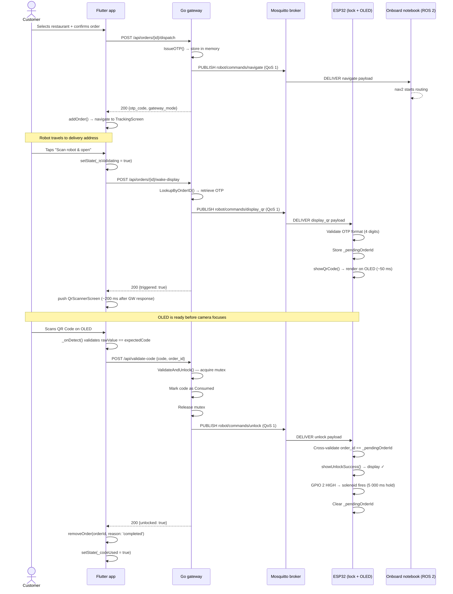
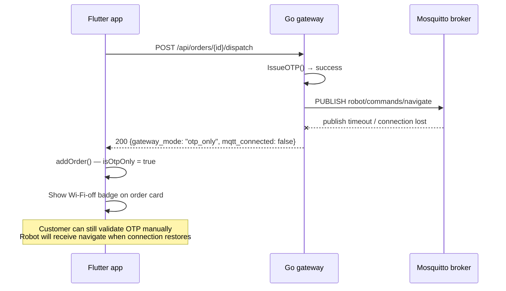
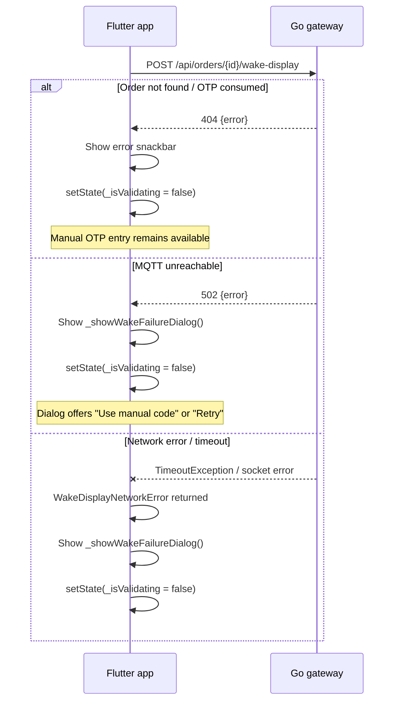
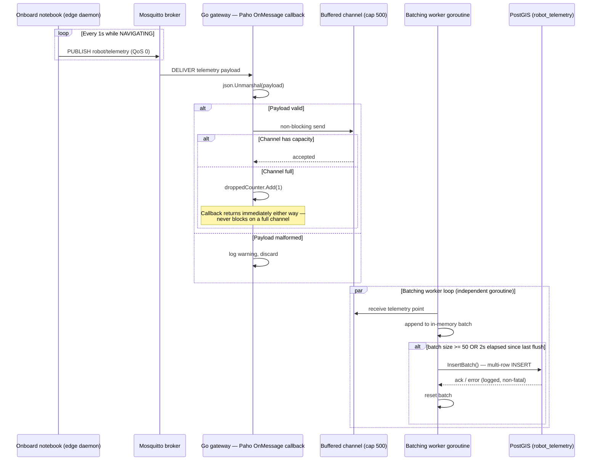
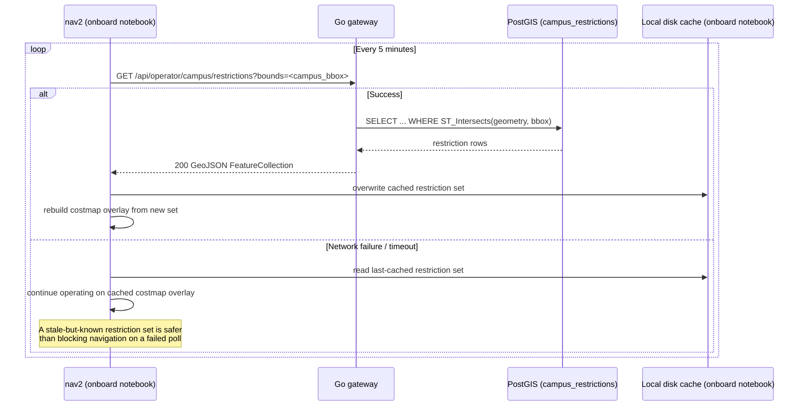
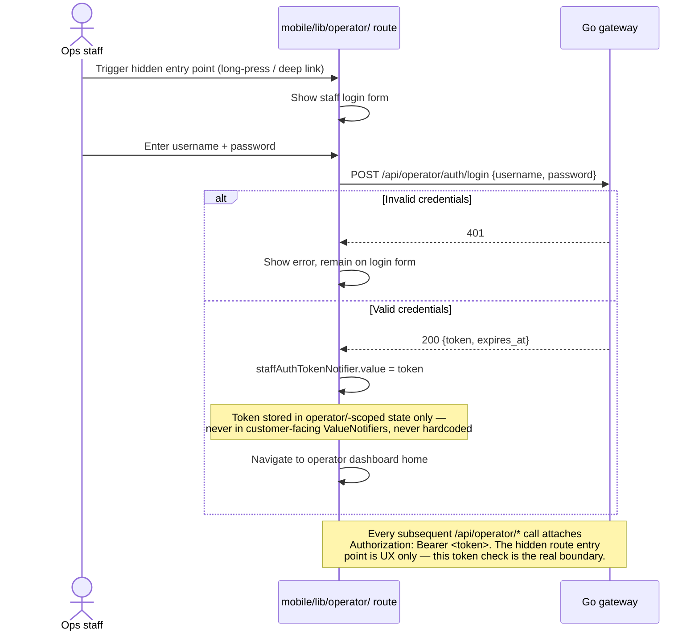
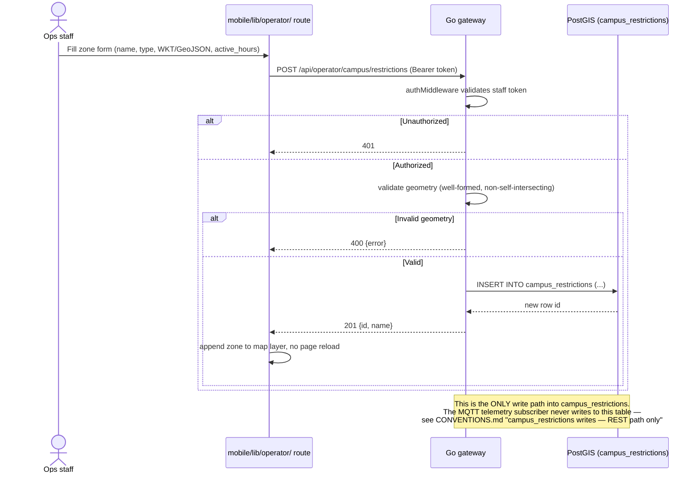
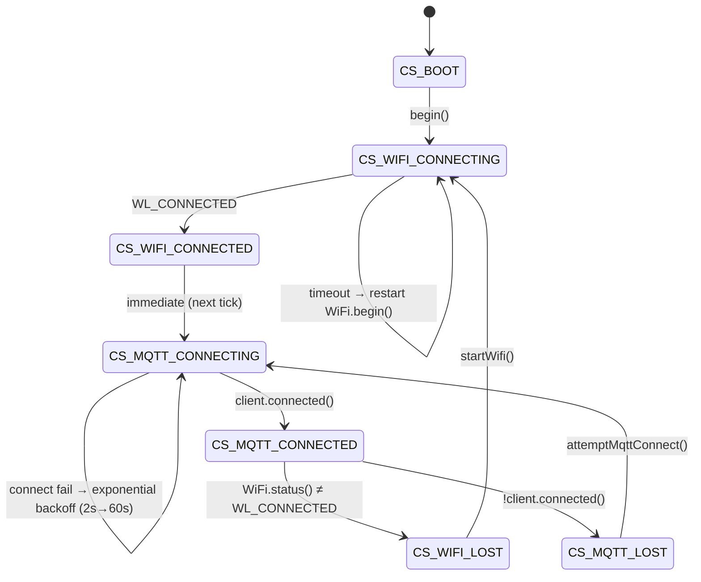
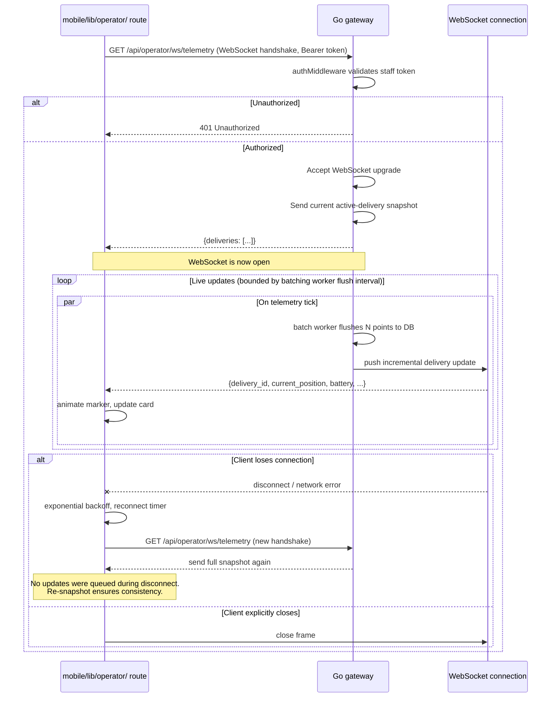

# UnBot Delivery — State Flows & Invariants

## On-demand optical MFA — full sequence

This is the primary delivery sequence introduced in Phase 1.5. The QR Code is rendered lazily (when the customer initiates the scan), not eagerly (at dispatch time).



---

## Degraded mode — MQTT unreachable at dispatch



---

## Wake-display failure paths



---

## Telemetry ingestion — MQTT to PostGIS

This flow is deliberately decoupled at the goroutine level to satisfy the non-blocking MQTT invariant (CONVENTIONS.md). The Paho callback and the Postgres write never share a call stack.



**Invariants:**
- The Paho callback (`CB`) never calls into `PG` directly, under any code path, including error handling.
- Channel overflow drops the **oldest-pending** telemetry point implicitly (Go's `select`/`default` pattern drops the point being sent, not a queued one — for `robot_telemetry` this is acceptable data loss; it is never acceptable for `deliveries` status-transition messages, which must use a separate, larger-capacity or blocking-with-timeout channel if the same batching architecture is reused for them).
- A failed `InsertBatch()` is logged and the batch is discarded, not retried indefinitely — telemetry is best-effort observability data, not transactional state. Retrying indefinitely against a degraded Postgres would itself become a backpressure source into the channel.
- `robot/status/heartbeat` (QoS 1, delivery status / fault authority) is **not** subject to this drop policy — heartbeat-driven `deliveries.status` transitions use a dedicated, higher-priority path that is allowed to block briefly (bounded by a short timeout) rather than silently drop a `FAULT` transition.
- This flow is unaffected by the Raspberry Pi → x86 notebook hardware pivot — only the participant label changed.

---

## Campus restriction refresh — nav2 polling with cached fallback

nav2 (running on the onboard notebook) never holds a live database or MQTT subscription to `campus_restrictions`. It polls the Gateway's REST endpoint and degrades to cache on failure — a stale restriction set is preferable to blocking navigation on a network call.



**Invariant:** nav2's navigation loop never blocks on this poll. The poll runs on its own timer, independent of the navigation goal execution loop, and a poll failure is logged but never propagated as a navigation fault. **This flow is unaffected by the hardware pivot** — the x86 notebook's larger local disk is, if anything, more forgiving for the cache file than the Pi's SD card would have been.

---

## Operator staff authentication — login flow (NEW)

Precedes any `/api/operator/*` call other than `POST /api/operator/auth/login` itself. Runs inside the hidden `mobile/lib/operator/` route.



---

## Operator zone authorship — REST-only write path



---

## Go OTP service — state invariants

```
OTPRecord.Consumed transitions: false → true (one-way, irreversible)

ValidateAndUnlock critical section:
  1. Acquire mu
  2. Look up code → if absent: release mu, return ErrInvalidCode
  3. If Consumed: release mu, return ErrConsumed
  4. Set Consumed = true
  5. Release mu          ← code is consumed before MQTT publish
  6. Publish unlock
  7. If publish fails: return ErrPublish (code already consumed — no replay)

Invariant: a code can open exactly one compartment, regardless of
concurrent requests, MQTT failures, or client retries.
```

---

## `deliveries.status` — state invariants

```
deliveries.status transitions: PENDING → DISPATCHED → NAVIGATING → (DELIVERED | FAILED)

Sourced from robot/status/heartbeat (QoS 1), not robot/telemetry (QoS 0).
Enforced one-way at the schema level — mirrors OTPRecord.Consumed.

Once DELIVERED or FAILED, no further transition is accepted; a heartbeat
arriving after terminal state is logged as an anomaly (e.g., ESP32/onboard
notebook clock drift or duplicate delivery) and discarded, not applied.
```

---

## ESP32 connection state machine



**Key invariant**: `client.loop()` is called **only** in `CS_MQTT_CONNECTED`. Calling it in any other state reads from a null/stale TCP socket and can trigger a hard fault on ESP-IDF.

---

## Flutter `ValueNotifier` mutation rules (mobile app — customer screens)

All three global notifiers follow the same immutable-swap protocol:

```
// CORRECT — triggers listeners
activeOrdersNotifier.value = [...current, newOrder];

// WRONG — mutates list in place, listeners DO NOT fire
activeOrdersNotifier.value.add(newOrder);  // ← NEVER DO THIS
```

`removeOrder()` is atomic from the UI's perspective:
1. Find departing order in `activeOrdersNotifier.value`
2. Call `archivePastOrder()` → prepend to `pastOrdersNotifier.value`
3. Write filtered list to `activeOrdersNotifier.value`

Both notifiers fire in the same synchronous call stack. No frame exists where an order is absent from both lists simultaneously.

**The `operator/` route's notifiers (`activeDeliveriesNotifier`, `staffAuthTokenNotifier`) follow the same immutable-swap discipline but are declared and scoped entirely within `mobile/lib/operator/` — see CONVENTIONS.md.**

---

## Active order lifecycle (mobile app — customer screens)

```
Placement          Tracking           Pickup              Archive
─────────          ────────           ──────              ───────
addOrder()    →    activeOrdersNotifier  →  removeOrder(    →  pastOrdersNotifier
                   isOtpOnly badge          reason: 'completed'   reason badge:
                   TrackingScreen           or 'cancelled')       'Entregue' / 'Cancelado'
```

`reason: 'completed'` is set by `code_screen.dart` (OTP validated).  
`reason: 'cancelled'` is set by the cancel dialog in `tracking_screen.dart`.  
Default parameter on `removeOrder()` is `'completed'` — callers at non-happy-path sites must be **explicit**.

---

## Edge daemon RobotStateMachine — delivery lifecycle

Runs on the onboard x86 notebook. Unaffected in logic by the hardware pivot from Raspberry Pi.

```mermaid
stateDiagram-v2
    [*] --> IDLE
    IDLE --> NAVIGATING : receive robot/commands/navigate
    NAVIGATING --> NAVIGATING : publish telemetry at 1 Hz
    NAVIGATING --> COMPLETE : receive robot/commands/unlock (from unlock_observer)
    NAVIGATING --> OFFLINE_HOLD : lose MQTT connection
    OFFLINE_HOLD --> NAVIGATING : MQTT reconnects (resume active goal)
    OFFLINE_HOLD --> FAULT : exceed offline_timeout (safety)
    NAVIGATING --> FAULT : nav2 signals unrecoverable error
    COMPLETE --> IDLE : clear active goal, mark delivery terminal
    FAULT --> IDLE : human intervention / reset command

    Note over IDLE,FAULT: Telemetry publishes only during NAVIGATING.<br/>Heartbeat publishes every 30s in all states.<br/>Delivery status written to `deliveries` table via heartbeat (QoS 1),<br/>not via telemetry (QoS 0).
```

---

## Operator route WebSocket subscription lifecycle



---

## Data model — PostgreSQL schema

### `robot_telemetry` table

```sql
CREATE TABLE robot_telemetry (
  id BIGSERIAL PRIMARY KEY,
  delivery_id UUID NOT NULL,
  timestamp TIMESTAMPTZ NOT NULL,
  pose GEOMETRY(POINT, 4326),
  battery_percent SMALLINT,   -- robot traction battery, NOT the onboard notebook's own battery
  wifi_rssi_dbm SMALLINT,
  nav_goal_id VARCHAR(64),
  status VARCHAR(32),
  error_code VARCHAR(64),
  created_at TIMESTAMPTZ DEFAULT NOW()
);

CREATE INDEX idx_robot_telemetry_delivery_timestamp 
  ON robot_telemetry(delivery_id, timestamp);
CREATE INDEX idx_robot_telemetry_pose 
  ON robot_telemetry USING GIST(pose);
```

**Schema note:** if onboard compute battery state is needed later (distinct from robot traction battery), add a separate `compute_battery_percent` column rather than overloading `battery_percent` — see ARCHITECTURE.md → "Hardware topology" for the rationale.

### `deliveries` table

```sql
CREATE TABLE deliveries (
  id UUID PRIMARY KEY,
  order_id VARCHAR(64) NOT NULL UNIQUE,
  customer_id UUID NOT NULL,
  restaurant_id UUID NOT NULL,
  destination GEOMETRY(POINT, 4326),
  planned_route GEOMETRY(LINESTRING, 4326),
  actual_route GEOMETRY(LINESTRING, 4326),
  dispatched_at TIMESTAMPTZ,
  completed_at TIMESTAMPTZ,
  status VARCHAR(32),
  failure_reason VARCHAR(256),
  created_at TIMESTAMPTZ DEFAULT NOW(),
  
  CHECK (status IN ('PENDING', 'DISPATCHED', 'NAVIGATING', 'DELIVERED', 'FAILED'))
);

CREATE INDEX idx_deliveries_status ON deliveries(status);
```

### `campus_restrictions` table

```sql
CREATE TABLE campus_restrictions (
  id SERIAL PRIMARY KEY,
  name VARCHAR(256),
  geometry GEOMETRY(POLYGON, 4326),
  restriction_type VARCHAR(32),
  active_hours TSRANGE,
  created_by UUID,
  created_at TIMESTAMPTZ DEFAULT NOW(),
  
  CHECK (restriction_type IN ('NO_ENTRY', 'SLOW_ZONE', 'INDOOR_ONLY'))
);

CREATE INDEX idx_campus_restrictions_geometry 
  ON campus_restrictions USING GIST(geometry);
```

All geometry columns use `SRID 4326` (WGS 84 lat/lon). `GIST` indices are mandatory for spatial queries.

### `staff_users` table (NEW — required by operator auth flow)

```sql
CREATE TABLE staff_users (
  id UUID PRIMARY KEY DEFAULT gen_random_uuid(),
  username VARCHAR(64) NOT NULL UNIQUE,
  password_hash VARCHAR(256) NOT NULL,   -- bcrypt/argon2, never plaintext
  created_at TIMESTAMPTZ DEFAULT NOW()
);
```

Backing store for `POST /api/operator/auth/login` (see PROTOCOL.md). Token issuance/validation logic (JWT or opaque token + session table) is an implementation detail left to the Go gateway's auth middleware — not specified further here, but must not be skipped or stubbed out "temporarily" for the milestone, since this table backs the only real access control on `/api/operator/*`.
